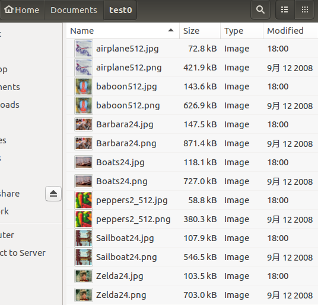
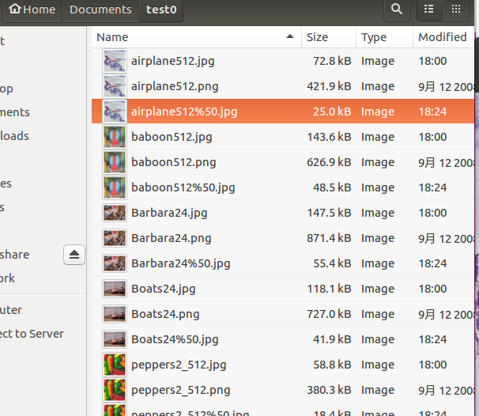
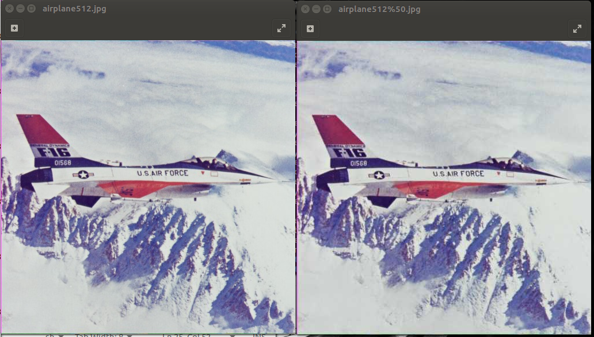
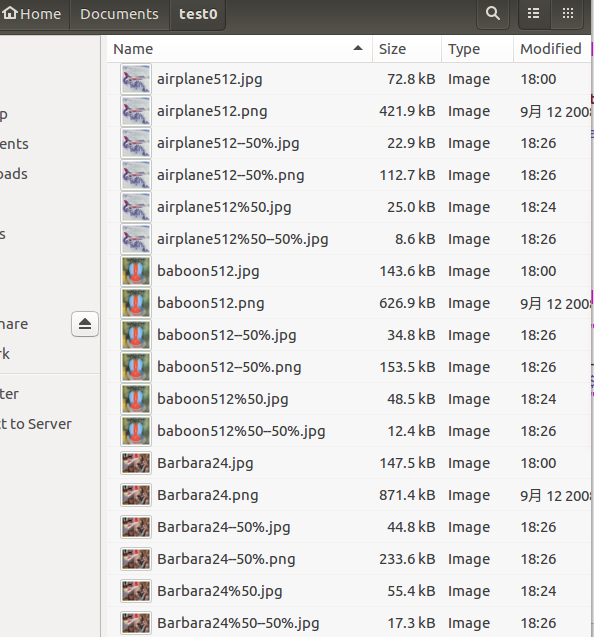
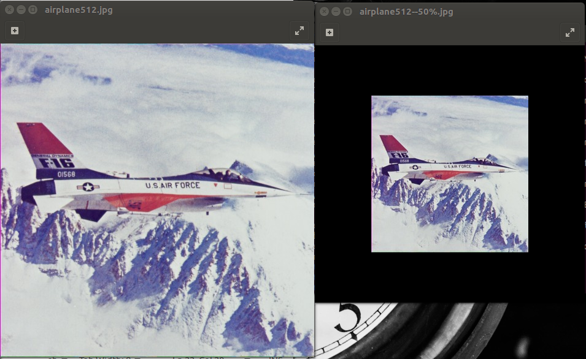
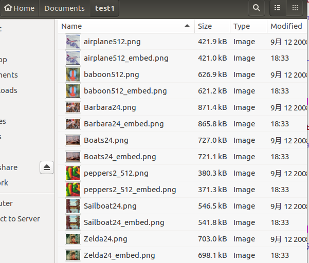
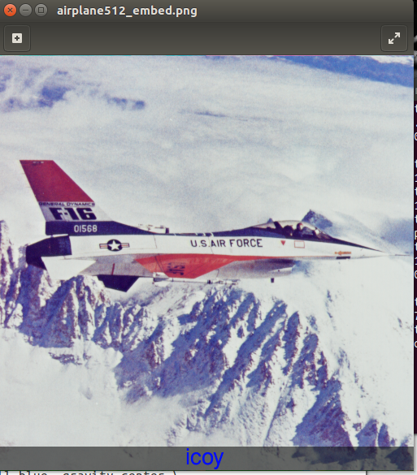
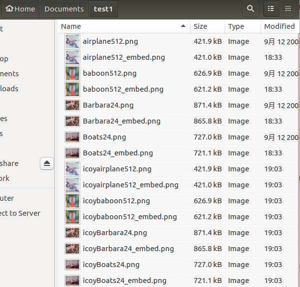

# SHELL脚本编程基础 

## 实验环境

- Ubuntu 16.04 Desktop 64bit

## 任务一：用bash编写一个图片批处理脚本

[work_1.sh](code/work_1.sh)

- 帮助文档

- 支持将png/svg图片统一转换为jpg格式图片

- 支持对jpeg格式图片进行图片质量压缩

- 支持对jpeg/png/svg格式图片在保持原始宽高比的前提下压缩分辨率

- 支持对图片批量添加自定义文本水印

- 支持批量重命名（统一添加文件名前缀或后缀，不影响原始文件扩展名）

## 任务二：用bash编写一个文本批处理脚本，对附件“2014世界杯运动员数据”进行批量处理完成相应的数据统计任务 

[work_2.sh](code/work_2.sh)

输出结果：[输出结果](code/work_2.txt)

## 实验备注

- 任务一，二在理解借鉴同学代码的基础下，修改并简化了一下，任务二将输出结果写在了一个txt文件里
