# 无人值守Linux安装镜像制作

## 实验目标

- **配置无人值守安装iso并在Virtualbox中完成自动化安装**
  - 使用sftp在虚拟机和宿主机之间传输文件
  - 实现ubuntu系统开机自动启用和自动获取IP 

## 实验环境及工具

- Ubuntu 16.04.4 Server 64bit
- VirtualBox
- PuTTY
- PSFTP

## 实验过程

1. VirtualBoxs安装实验用Ubuntu虚拟机，设定两块网卡备用，一块使用NAT网络（连接外网），另一块使用Host-only网络（连接宿主机，已启用DHCP）

2. 使用命令dhclient启用第二块网卡，自动动态分配地址（192.168.56.102）

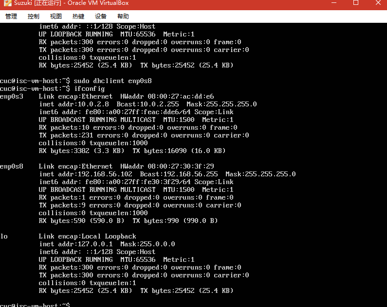

3. 使用putty工具连接虚拟机

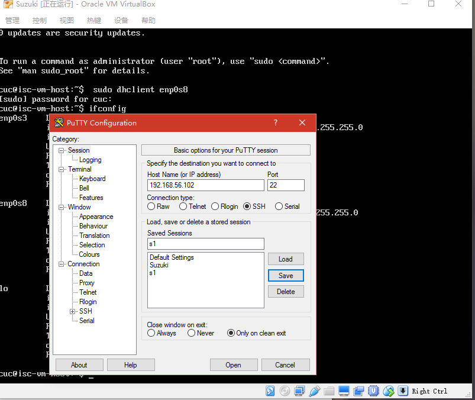

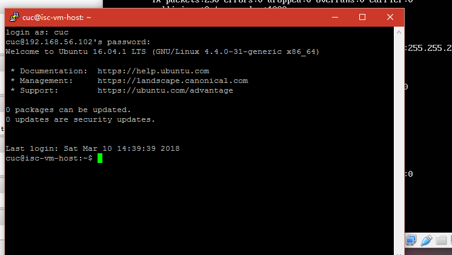

4. 下载镜像（ubuntu-16.04.1-server-amd64.iso）并挂载到新建工作目录 
   - mkdir loopdir：在当前用户目录下创建一个用于挂载iso镜像文件的目录(loopdir)
   - mount -o loop ubuntu-16.04.1-server-amd64.iso loopdir：挂载iso镜像文件到该目录
   - mkdir cd： 创建一个工作目录(cd)用于克隆光盘内容
   - rsync -av loopdir/ cd：同步光盘内容到目标工作目录
   - umount loopdir：卸载iso镜像

5.编辑Ubuntu安装引导界面增加一个自动安装菜单项(编辑并强制保存文件txt.cfg)

- 添加内容：
```
label autoinstall
  menu label ^Auto Install Ubuntu Server
  kernel /install/vmlinuz
  append file=/cdrom/preseed/ubuntu-server-autoinstall.seed debian-installer/locale=en_US console-setup/layoutcode=us keyboard-configuration/layoutcode=us console-setup/ask_detect=false localechooser/translation/warn-light=true localechooser/translation/warn-severe=true initrd=/install/initrd.gz root=/dev/ram rw quiet
```

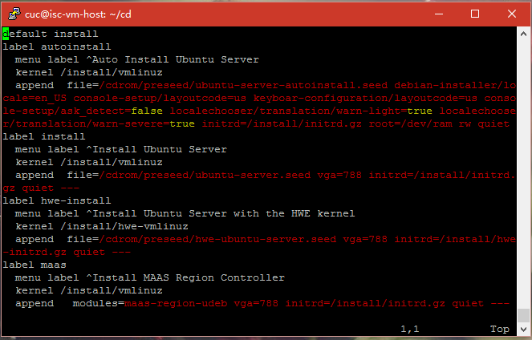

6. 使用PSFTP工具将定制好的seed文件移入虚拟机的cd/preseed文件夹中

 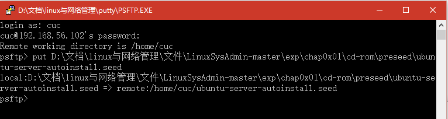

 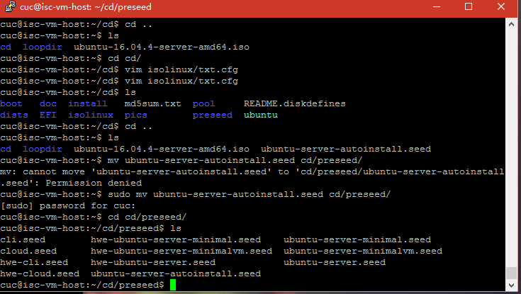

7. 重新生成md5sum.txt文件
- 首先使用命令 sudo chmod 777 md5sum.txt获得更改此文件的最高权限
- 命令：find . -type f -print0 | xargs -0 md5sum > /tmp/md5sum.txt

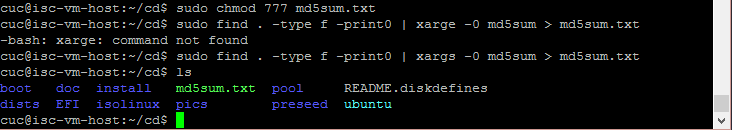

8. apt-get安装mkisofs封装iso工具

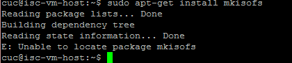

9. 创建test.sh脚本，然后添加命令

- 添加内容：
```
IMAGE=custom.iso
BUILD=~/cd/

            mkisofs -r -V "Custom Ubuntu Install CD" \
            -cache-inodes \
            -J -l -b isolinux/isolinux.bin \
            -c isolinux/boot.cat -no-emul-boot \
            -boot-load-size 4 -boot-info-table \
            -o $IMAGE $BUILD

```


10.运行test.sh，得到最终镜像custom.iso

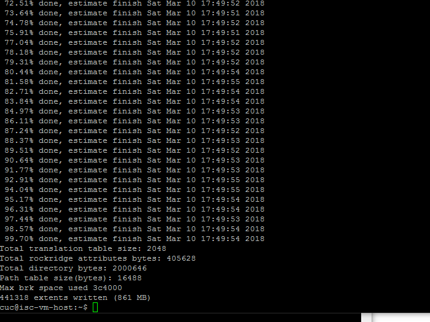

11. 将custom.iso使用PSFTP工具移入宿主机，并在VirtualBox中测试是否自动安装

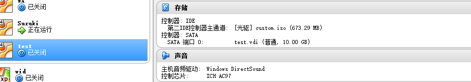

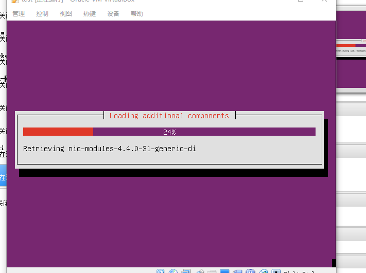

## 实验问题

1. 遇到nat网络无法获取正确动态网络段10.0.2.0/24导致无法联网下载，使用dhclient命令重新获得了正确地址
2. 遇到权限问题，多数都可以添加sudo解决
3. apt-get无法定位包，手动添加镜像源得以解决