##  FTP、NFS、DHCP、DNS、Samba服务器的自动安装与自动配置
 

### FTP

- 环境设置：vsftpd，使用内部网络测试
- server：10.0.1.2
- [ftp.sh](sh/ftp.sh)
- [vsftpd.conf](conf/vsftpd.conf)

##### [] 配置一个提供匿名访问的FTP服务器，匿名访问者可以访问1个目录且仅拥有该目录及其所有子目录的只读访问权限；

- 匿名连接，进入指定目录
- 匿名用户只有读取权限

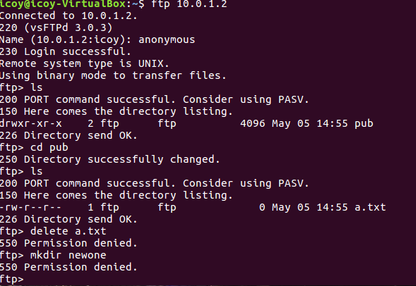
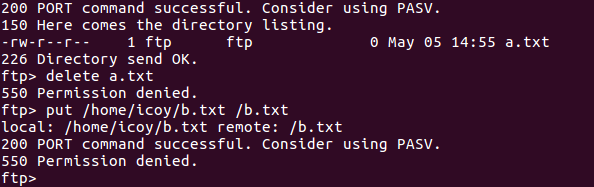

##### [] 配置一个支持用户名和密码方式访问的账号，该账号继承匿名访问者所有权限，且拥有对另1个独立目录及其子目录完整读写（包括创建目录、修改文件、删除文件等）权限；
    
- 用户icoy

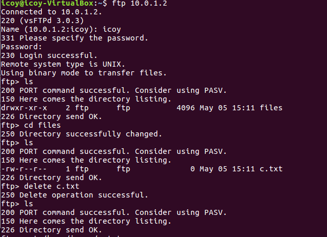

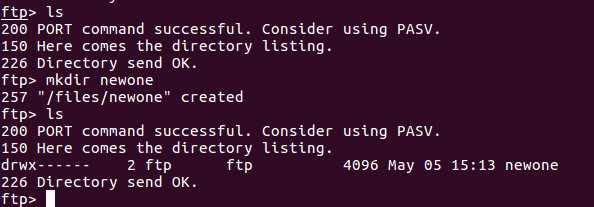

##### [] FTP用户不能越权访问指定目录之外的任意其他目录和文件；

-匿名用户访问其他目录失败

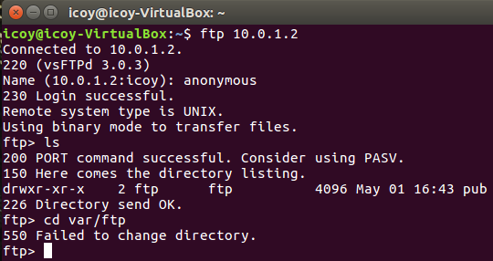

-主用户访问其他目录失败

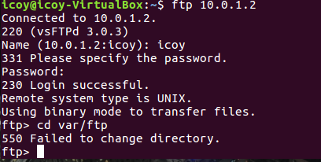

##### [] 匿名访问权限仅限白名单IP来源用户访问，禁止白名单IP以外的访问；

- 更改hosts.allow中的主机ip后

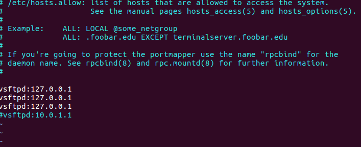

###### [参考文档：https://www.digitalocean.com/community/tutorials/how-to-set-up-vsftpd-for-a-user-s-directory-on-ubuntu-16-04](https://www.digitalocean.com/community/tutorials/how-to-set-up-vsftpd-for-a-user-s-directory-on-ubuntu-16-04)
###### [参考文档：http://www.g-loaded.eu/2008/12/02/set-up-an-anonymous-ftp-server-with-vsftpd-in-less-than-a-minute/](http://www.g-loaded.eu/2008/12/02/set-up-an-anonymous-ftp-server-with-vsftpd-in-less-than-a-minute/)
---
### NFS

- 环境设置：client：10.0.1.1 host:10.0.1.2
- [nfs-host.sh](sh/nfs-host.sh)
- [nfs-client.sh](sh/nfs-client.sh)

##### []在1台Linux上配置NFS服务，另1台电脑上配置NFS客户端挂载2个权限不同的共享目录，分别对应只读访问和读写访问权限；

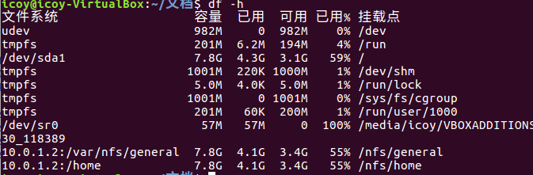

- 分别对应只读访问(/home)和读写访问权限(/general)

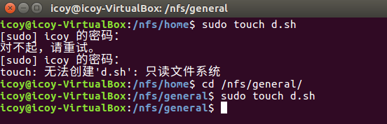

##### []通过NFS客户端在NFS共享目录中新建的目录、创建的文件的属主、权限信息

- 客户端

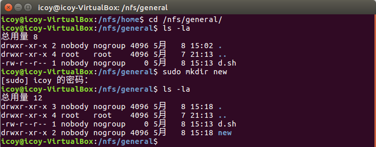

- 服务端

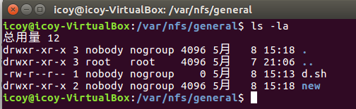

##### []NFS目录中的属主和属主组信息是否一致

- 没有设置no_root_squash参数，客户端和服务端目录中的属主和属主组信息一致

- 资料原文：The no_root_squash  parameter allows the superuser (root) to be treated as such by the NFS server; otherwise root will be remapped to nobody and will generally be unable to do anything useful with the filesystem. The no_all_squash  parameter is similar but applies to non-root users. See the exports(5)  man page for details.

- [link](http://www.softpanorama.org/Net/Application_layer/NFS/mounting_nfs_directory_owned_by_root.shtml)

---
### DHCP

- 环境设置：server：10.0.3.0，使用isc-dhcp-server
- client:获得ip地址段：10.0.3.2-10.0.3.100

- [dhcp.sh](sh/dhcp.sh)
- [dhcpd.conf](conf/dhcpd.conf)

##### 2台虚拟机使用Internal网络模式连接，其中一台虚拟机上配置DHCP服务，另一台服务器作为DHCP客户端，从该DHCP服务器获取网络地址配置
- server：启动dhcp服务

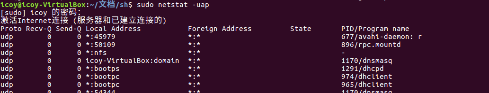

- client：ip设置更改为自动（DHCP） 
 
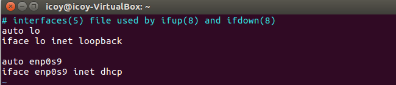

- 重启网络服务

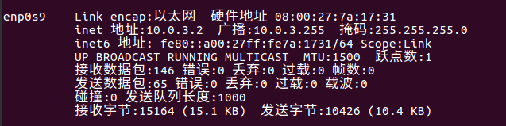

---
### Samba

- 环境设置：server：192.168.56.102
- [samba.sh](sh/samba.sh)
- [smb.conf](conf/smb.conf)

##### Linux设置用户名密码方式的共享目录

##### Linux设置匿名访问共享目录
 
 
 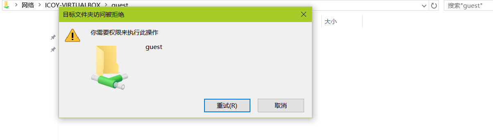
 
---
