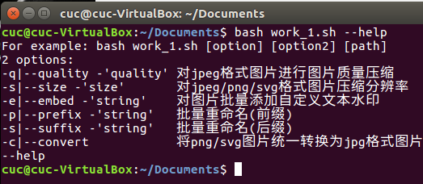
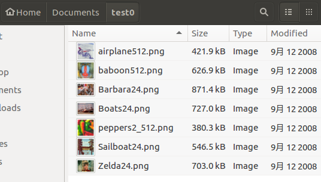
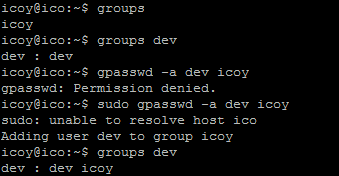
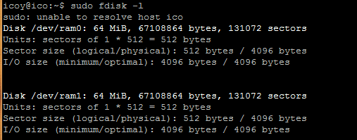
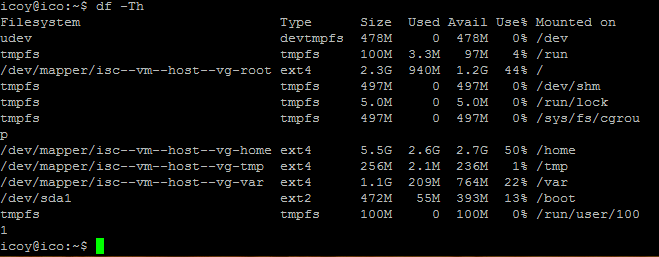

# Systemd
## 一、实验环境

- Ubuntu 16.04 Server 64位
- asciinema

## 二、实验过程

### 命令篇：
- [系统管理](https://asciinema.org/a/172186)
- [Unit](https://asciinema.org/a/172190)
- [Unit的配置文件和target](https://asciinema.org/a/172193)
- [日志管理](https://asciinema.org/a/172194)

### 实战篇：
- [实战](https://asciinema.org/a/172201)

## 三、自查清单

- 如何添加一个用户并使其具备sudo执行程序的权限？

      1.添加用户：adduser 'username'
      2.编辑/etc/sudoers文件，在“User Privilege specification”项后添加‘username’ ALL=(ALL:ALL)ALL

- 如何将一个用户添加到一个用户组？

      gpasswd -a ‘username’ ‘groupname’

- 如何查看当前系统的分区表和文件系统详细信息？

      fdisk -l and df -Th
      
- 如何实现开机自动挂载Virtualbox的共享目录分区？

      修改文件/etc/rc.local，添加命令：
      mount -t vboxsf +‘共享目录路径’

**需安装增强功能，才能实现基本的挂载，然而未能实现，网上说明过于复杂**

- 基于LVM（逻辑分卷管理）的分区如何实现动态扩容和缩减容量？

      lvextend -L +‘容量’  ‘逻辑卷路径’
      lvreduce -L -‘容量’  ‘逻辑卷路径’

**没有尝试，资料来自https://www.tecmint.com/extend-and-reduce-lvms-in-linux/**

- 如何通过systemd设置实现在网络连通时运行一个指定脚本，在网络断开时运行另一个脚本？

      修改networking.service配置文件,在[Service]区块下的[ExecStart]和[ExecStop]字段添加脚本路径

- 如何通过systemd设置实现一个脚本在任何情况下被杀死之后会立即重新启动？实现杀不死？
 
      修改脚本配置文件，在[Service]区块下的[Restart]字段设置成“alwalys”

