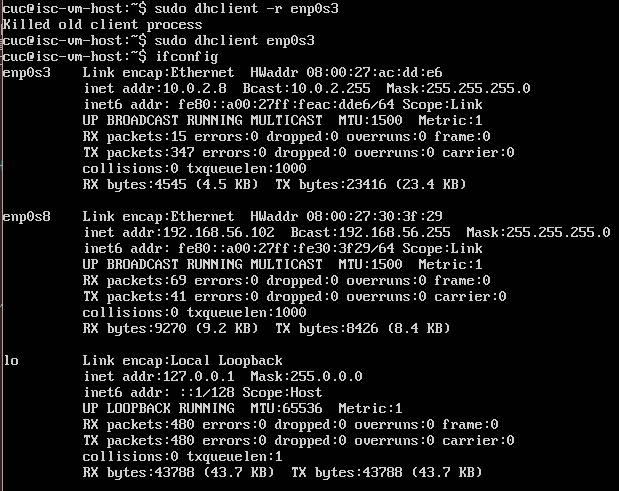

# Vimtutor练习


## 一、实验环境

- Ubuntu 16.04 Server 64位
- asciinema

## 二、实验过程

### 1、配置 asciinema

- 安装：

        sudo apt-add-repository ppa:zanchey/asciinema
    	sudo apt-get update
    	sudo apt-get install asciinema
    	
- 远程绑定账号：

        asciinem auth
        
- 开始录制： 

        asciinema rec
        
- 结束录制：

        exit


### 2、vimtutor练习

- [录制的视频](https://asciinema.org/a/JXgGL1FozUoBs3dD481dBtNGO)

### 3、自查清单

#### - 你了解vim有哪几种工作模式？

    正常模式(normal-mode) 命令模式(command-mode) 插入模式(insert-mode) 可视模式(visual-mode) 
    

#### - Normal模式下，从当前行开始，一次向下移动光标10行的操作方法？

	<type>  j10

#### - 如何快速移动到文件开始行和结束行？如何快速跳转到文件中的第N行？

	移动开始行：<type>  gg
	移动结束行：<type>   G
	跳转第N行：<type> '行号' G

#### - Normal模式下，如何删除单个字符、单个单词、从当前光标位置一直删除到行尾、单行、当前行开始向下数N行？

    删除单个字符：<type>  x
	单个单词：<type>  dw
	从当前光标位置一直删除到行尾：<type>  d$
	单行：<type>  dd
	当前行开始向下数N行：<type>  dNd

#### - 如何在vim中快速插入N个空行？如何在vim中快速输入80个-？

	在vim中快速插入N个空行: <type>   '个数' i <ESC> 
	在vim中快速输入80个-: <type>    80 i - <ESC>

#### - 如何撤销最近一次编辑操作？如何重做最近一次被撤销的操作？
	
	撤销：<type>  u
	重做：<Ctrl>+R

#### - vim中如何实现剪切粘贴单个字符？单个单词？单行？如何实现相似的复制粘贴操作呢？

	复制:
		一行：<type>  yy
		单个字符：<type> yl 
		单词：<type>e  yw

	剪切:
		一行：<type>  dd 
		单个字符：<type>  dl 
		单词：<type>  dw

	粘贴:<type>  p  

#### - 为了编辑一段文本你能想到哪几种操作方式（按键序列）？

	vim + 文件名，i插入（o在行尾插入），编写（剪切、复制、粘贴），<esc>，:wq保存

#### - 查看当前正在编辑的文件名的方法？查看当前光标所在行的行号的方法？

	查看当前正在编辑的文件名： ：（命令模式） f
	
	查看当前光标所在行的行号：<Ctrl>+G
	
#### - 在文件中进行关键词搜索你会哪些方法？如何设置忽略大小写的情况下进行匹配搜索？如何将匹配的搜索结果进行高亮显示？如何对匹配到的关键词进行批量替换？

	关键词搜索: /[worlds]
	
	忽略大小写的情况下进行匹配搜索:   ：(命令模式)set ic
	
	高亮:  ：(命令模式)set hls is
	
	批量替换:   ：(命令模式) #,#s/old/new/g   ————其中，#,#是要更改的行号的范围
				：(命令模式) %s/old/new/g     ————更改全文件中的所有事件
				：(命令模式) %s/old/new/gc    ————更改全文件中的所有事件,并给出替换与否的提示
	
#### - 在文件中最近编辑过的位置来回快速跳转的方法？
	
	Ctrl+O（前），Ctrl+I（后）
	
#### - 如何把光标定位到各种括号的匹配项？例如：找到(, [, or {对应匹配的),], or }

	<type> %

#### - 在不退出vim的情况下执行一个外部程序的方法？

	:（命令模式）i + 外部程序命令

#### - 如何使用vim的内置帮助系统来查询一个内置默认快捷键的使用方法？如何在两个不同的分屏窗口中移动光标？

	查询一个内置默认快捷键  :（命令模式) help + 快捷键名称
	
	不同的分屏窗口中移动光标 <Ctrl>+W  

#### - putty中vim与主机的复制粘贴

	<shift> + 命令
	
## 三、实验问题

### 1.和第一次问题一样，使用nat的网卡没有获得正确的地址

- 解决方法为：
  
```
$ dhclient -r enp0s3 ————先释放ip
$ dhclient enp03 ————重新获得地址
```


### 2.运行 asciinema 字符环境问题：asciinema needs a UTF-8 native locale to run. Check the output of `locale` command.

- 解决方法为： 生成并导出 UTF-8 语言环境：

```
$ localedef -c -f UTF-8 -i en_US en_US.UTF-8
$ export LC_ALL=en_US.UTF-8
```


	

	

